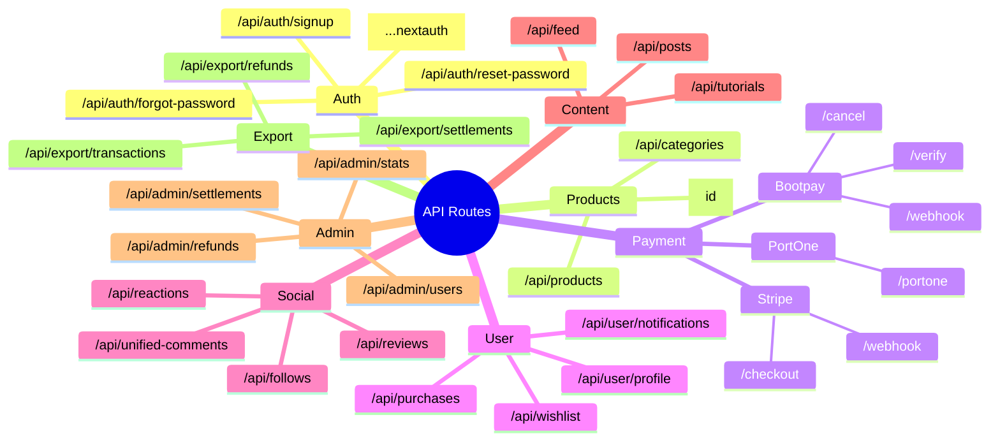
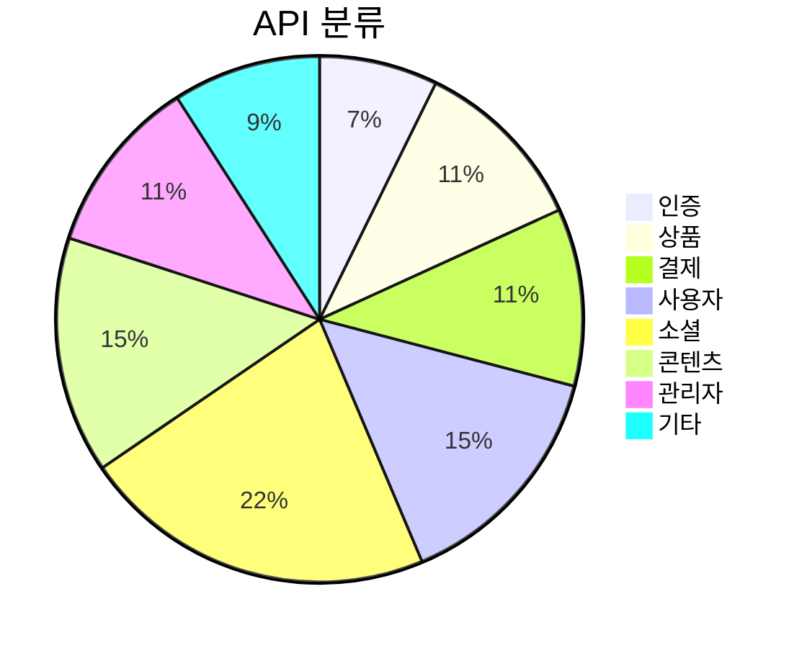

# 🔌 API 엔드포인트 맵 (API Map)

#api #backend

> 모든 API 엔드포인트 목록 및 구조
> 총 35+ 엔드포인트

---

## 📊 API 구조 마인드맵

---

## 🔐 인증 API (Auth)

| 메서드 | 엔드포인트 | 설명 | 인증 |
|--------|------------|------|------|
| `*` | `/api/auth/[...nextauth]` | NextAuth.js 핸들러 | - |
| `POST` | `/api/auth/signup` | 이메일 회원가입 | ❌ |
| `POST` | `/api/auth/forgot-password` | 비밀번호 재설정 요청 | ❌ |
| `POST` | `/api/auth/reset-password` | 비밀번호 재설정 | ❌ |

---

## 🛒 상품 API (Products)

| 메서드 | 엔드포인트 | 설명 | 인증 |
|--------|------------|------|------|
| `GET` | `/api/products` | 상품 목록 | ❌ |
| `POST` | `/api/products` | 상품 등록 | ✅ 판매자 |
| `GET` | `/api/products/[id]` | 상품 상세 | ❌ |
| `PATCH` | `/api/products/[id]` | 상품 수정 | ✅ 소유자 |
| `DELETE` | `/api/products/[id]` | 상품 삭제 | ✅ 소유자 |
| `GET` | `/api/categories` | 카테고리 목록 | ❌ |

---

## 💳 결제 API (Payment)

### Bootpay (한국 결제)

| 메서드 | 엔드포인트 | 설명 | 인증 |
|--------|------------|------|------|
| `POST` | `/api/payment/bootpay/verify` | 결제 검증 | ✅ |
| `POST` | `/api/payment/bootpay/cancel` | 결제 취소/환불 | ✅ |
| `POST` | `/api/payment/bootpay/webhook` | Bootpay 웹훅 | 서명 검증 |

### PortOne

| 메서드 | 엔드포인트 | 설명 | 인증 |
|--------|------------|------|------|
| `POST` | `/api/payment/portone` | PortOne 결제 | ✅ |

### Stripe

| 메서드 | 엔드포인트 | 설명 | 인증 |
|--------|------------|------|------|
| `POST` | `/api/checkout` | Stripe 세션 생성 | ✅ |
| `POST` | `/api/webhook` | Stripe 웹훅 | 서명 검증 |

---

## 👤 사용자 API (User)

| 메서드 | 엔드포인트 | 설명 | 인증 |
|--------|------------|------|------|
| `GET` | `/api/user/profile` | 내 프로필 | ✅ |
| `PATCH` | `/api/user/profile` | 프로필 수정 | ✅ |
| `GET` | `/api/notifications` | 알림 목록 | ✅ |
| `PATCH` | `/api/notifications/[id]` | 알림 읽음 처리 | ✅ |
| `GET` | `/api/purchases` | 구매 내역 | ✅ |
| `GET` | `/api/purchases/[id]` | 구매 상세 | ✅ |
| `GET` | `/api/wishlist` | 위시리스트 | ✅ |
| `POST` | `/api/wishlist` | 위시리스트 추가 | ✅ |
| `DELETE` | `/api/wishlist/[id]` | 위시리스트 삭제 | ✅ |

---

## 🤝 소셜 API (Social)

### 팔로우

| 메서드 | 엔드포인트 | 설명 | 인증 |
|--------|------------|------|------|
| `GET` | `/api/follows` | 팔로우/팔로워 목록 | ✅ |
| `POST` | `/api/follows` | 팔로우 | ✅ |
| `DELETE` | `/api/follows/[id]` | 언팔로우 | ✅ |

### 리뷰

| 메서드 | 엔드포인트 | 설명 | 인증 |
|--------|------------|------|------|
| `GET` | `/api/reviews` | 리뷰 목록 | ❌ |
| `POST` | `/api/reviews` | 리뷰 작성 | ✅ 구매자 |
| `PATCH` | `/api/reviews/[id]` | 리뷰 수정 | ✅ 작성자 |
| `POST` | `/api/reviews/[id]/helpful` | 도움됨 투표 | ✅ |

### 반응 (통합)

| 메서드 | 엔드포인트 | 설명 | 인증 |
|--------|------------|------|------|
| `GET` | `/api/reactions` | 반응 조회 | ❌ |
| `POST` | `/api/reactions` | 반응 추가 | ✅ |
| `DELETE` | `/api/reactions/[id]` | 반응 삭제 | ✅ |

### 통합 댓글

| 메서드 | 엔드포인트 | 설명 | 인증 |
|--------|------------|------|------|
| `GET` | `/api/unified-comments` | 댓글 목록 | ❌ |
| `POST` | `/api/unified-comments` | 댓글 작성 | ✅ |
| `PATCH` | `/api/unified-comments/[id]` | 댓글 수정 | ✅ |
| `DELETE` | `/api/unified-comments/[id]` | 댓글 삭제 | ✅ |

---

## 📝 콘텐츠 API (Content)

### 커뮤니티 게시글

| 메서드 | 엔드포인트 | 설명 | 인증 |
|--------|------------|------|------|
| `GET` | `/api/posts` | 게시글 목록 | ❌ |
| `POST` | `/api/posts` | 게시글 작성 | ✅ |
| `GET` | `/api/posts/[id]` | 게시글 상세 | ❌ |
| `PATCH` | `/api/posts/[id]` | 게시글 수정 | ✅ 작성자 |
| `DELETE` | `/api/posts/[id]` | 게시글 삭제 | ✅ 작성자 |

### 튜토리얼

| 메서드 | 엔드포인트 | 설명 | 인증 |
|--------|------------|------|------|
| `GET` | `/api/tutorials` | 튜토리얼 목록 | ❌ |
| `POST` | `/api/tutorials` | 튜토리얼 작성 | ✅ 판매자 |
| `GET` | `/api/tutorials/[id]` | 튜토리얼 상세 | ❌ |

### 피드

| 메서드 | 엔드포인트 | 설명 | 인증 |
|--------|------------|------|------|
| `GET` | `/api/feed` | 통합 피드 | ❌ |

---

## 🏪 판매자 API (Seller)

| 메서드 | 엔드포인트 | 설명 | 인증 |
|--------|------------|------|------|
| `GET` | `/api/sellers/[id]` | 판매자 프로필 | ❌ |
| `GET` | `/api/analytics` | 판매 분석 | ✅ 판매자 |
| `GET` | `/api/settlements` | 정산 내역 | ✅ 판매자 |

---

## 🔧 관리자 API (Admin)

| 메서드 | 엔드포인트 | 설명 | 인증 |
|--------|------------|------|------|
| `GET` | `/api/admin/stats` | 통계 조회 | ✅ Admin |
| `GET` | `/api/admin/users` | 사용자 관리 | ✅ Admin |
| `GET` | `/api/admin/refunds` | 환불 관리 | ✅ Admin |
| `PATCH` | `/api/admin/refunds/[id]` | 환불 처리 | ✅ Admin |
| `GET` | `/api/admin/settlements` | 정산 관리 | ✅ Admin |
| `PATCH` | `/api/admin/settlements/[id]` | 정산 처리 | ✅ Admin |

---

## 📊 내보내기 API (Export)

| 메서드 | 엔드포인트 | 설명 | 인증 |
|--------|------------|------|------|
| `GET` | `/api/export/transactions` | 거래 내역 CSV | ✅ Admin |
| `GET` | `/api/export/settlements` | 정산 내역 CSV | ✅ Admin |
| `GET` | `/api/export/refunds` | 환불 내역 CSV | ✅ Admin |

---

## 🔍 검색/추천 API

| 메서드 | 엔드포인트 | 설명 | 인증 |
|--------|------------|------|------|
| `GET` | `/api/search` | 통합 검색 | ❌ |
| `GET` | `/api/recommendations` | 추천 상품 | ❌ |

---

## 🏥 시스템 API

| 메서드 | 엔드포인트 | 설명 | 인증 |
|--------|------------|------|------|
| `GET` | `/api/health` | 헬스 체크 | ❌ |
| `POST` | `/api/upload` | 파일 업로드 | ✅ |

---

## 📈 API 통계

---

## 🔗 관련 문서

- [[system-overview|시스템 개요]]
- [[tech-stack|기술 스택]]
- [[database-schema|데이터베이스 스키마]]
