# 💾 데이터베이스 스키마 (Database Schema)

#database #prisma

> Prisma 스키마 기반 데이터베이스 구조
> PostgreSQL (Supabase)

---

## 📊 ER 다이어그램 (Entity Relationship)

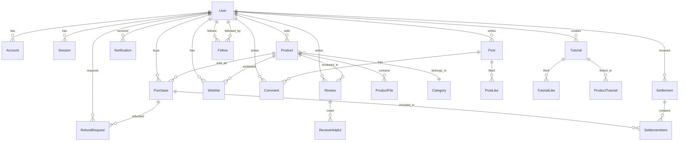

---

## 👤 사용자 모델 (User)

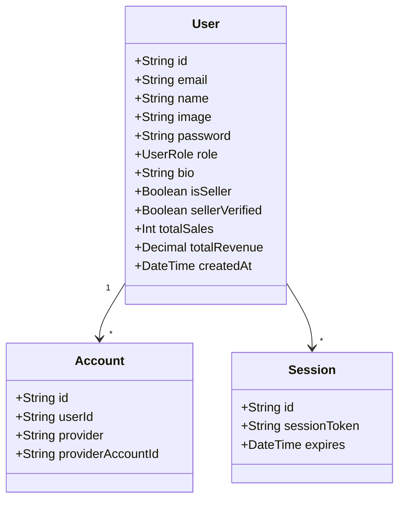

### 필드 설명
| 필드 | 타입 | 설명 |
|------|------|------|
| `id` | String | 고유 ID (cuid) |
| `email` | String | 이메일 (unique) |
| `name` | String? | 표시 이름 |
| `password` | String? | 해시된 비밀번호 |
| `role` | UserRole | USER / ADMIN |
| `isSeller` | Boolean | 판매자 여부 |
| `sellerVerified` | Boolean | 판매자 인증 여부 |
| `totalSales` | Int | 총 판매 건수 |
| `totalRevenue` | Decimal | 총 수익 |

---

## 🛒 상품 모델 (Product)

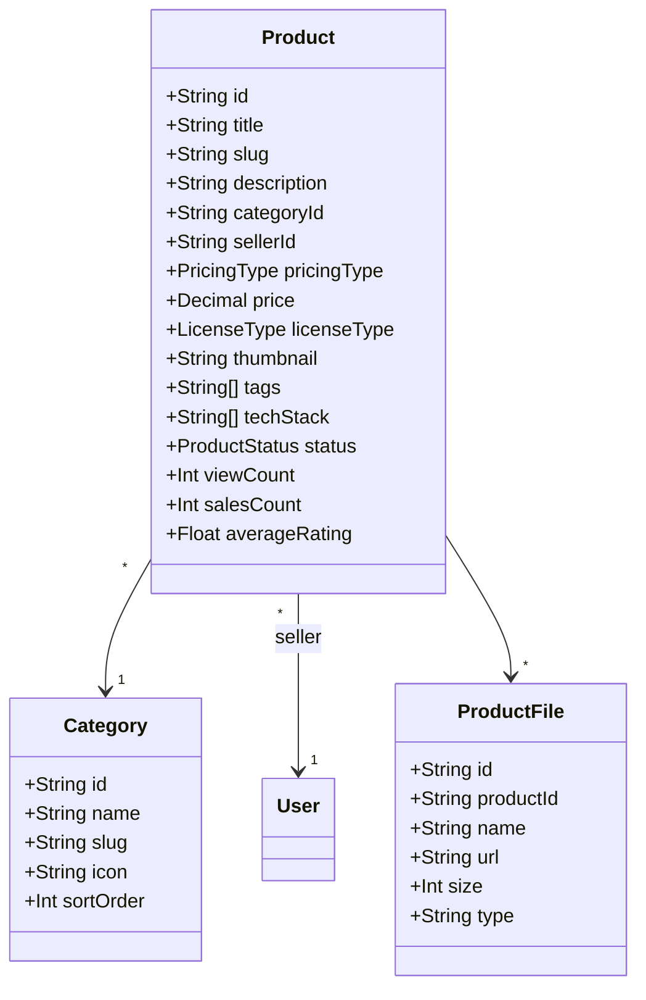

### Enum 값
```typescript
enum PricingType {
  FREE    // 무료
  PAID    // 유료
}

enum LicenseType {
  PERSONAL    // 개인용
  COMMERCIAL  // 상업용
  EXTENDED    // 확장 라이선스
}

enum ProductStatus {
  DRAFT           // 작성 중
  PENDING_REVIEW  // 검토 대기
  PUBLISHED       // 게시됨
  REJECTED        // 거부됨
  SUSPENDED       // 일시 중지
}
```

---

## 💳 구매 모델 (Purchase)

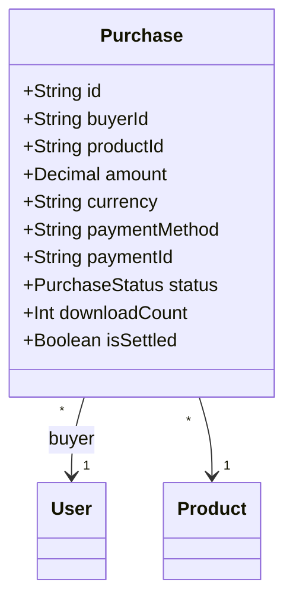

### 구매 상태
```typescript
enum PurchaseStatus {
  PENDING     // 결제 대기
  COMPLETED   // 완료
  FAILED      // 실패
  REFUNDED    // 환불됨
  CANCELLED   // 취소됨
}
```

---

## ⭐ 리뷰 모델 (Review)

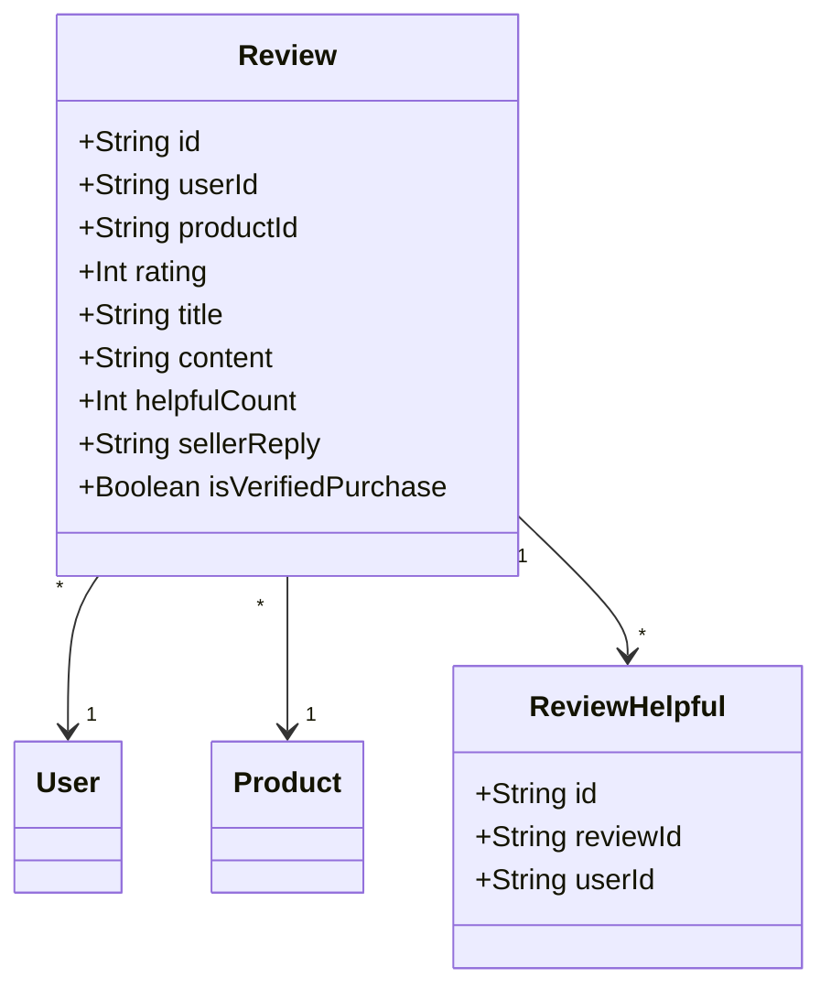

---

## 💬 커뮤니티 모델 (Community)

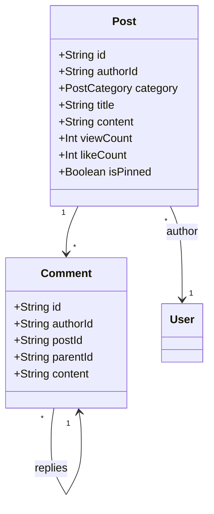

### 게시글 카테고리
```typescript
enum PostCategory {
  FREE      // 자유게시판
  QA        // Q&A
  FEEDBACK  // 피드백
  NOTICE    // 공지사항
}
```

---

## 📚 튜토리얼 모델 (Tutorial)

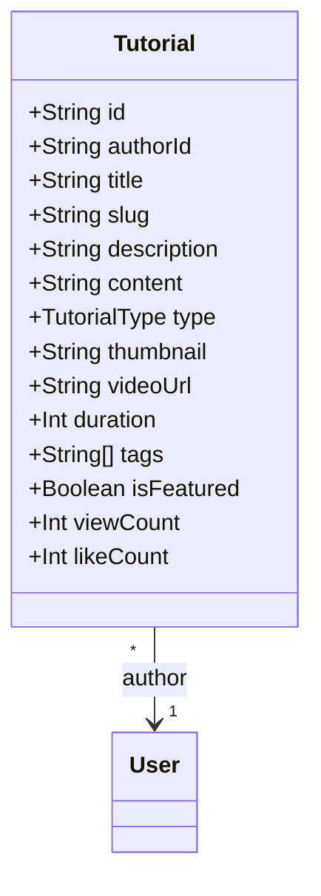

### 튜토리얼 유형
```typescript
enum TutorialType {
  TUTORIAL   // 튜토리얼
  MAKING     // 제작기
  TIPS       // 팁 & 트릭
  EXTERNAL   // 외부 자료
}
```

---

## 💰 정산 모델 (Settlement)

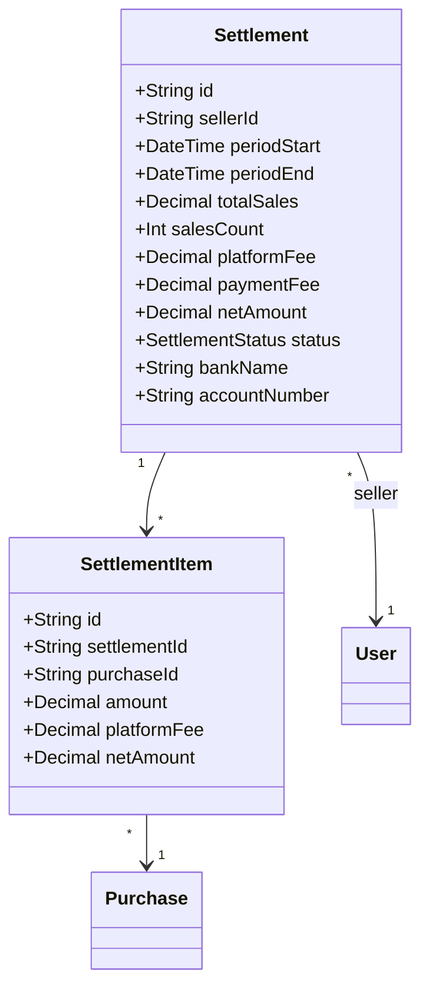

### 정산 상태
```typescript
enum SettlementStatus {
  PENDING     // 대기
  READY       // 준비 완료
  PROCESSING  // 처리 중
  COMPLETED   // 완료
  FAILED      // 실패
  CANCELLED   // 취소
}
```

---

## 🔄 환불 모델 (RefundRequest)

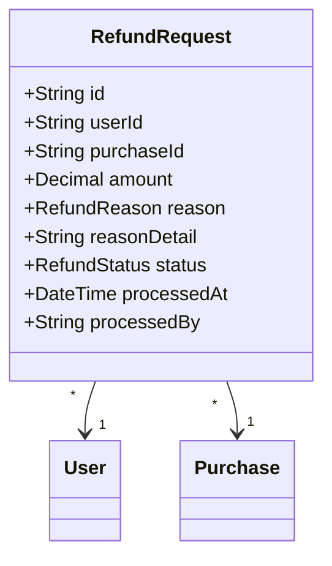

### 환불 사유
```typescript
enum RefundReason {
  PRODUCT_MISMATCH    // 상품 설명과 다름
  DOWNLOAD_ISSUE      // 다운로드 불가
  DUPLICATE_PURCHASE  // 중복 결제
  COPYRIGHT_ISSUE     // 저작권 문제
  TECHNICAL_ISSUE     // 기술적 문제
  OTHER               // 기타
}
```

---

## 🔔 알림 모델 (Notification)

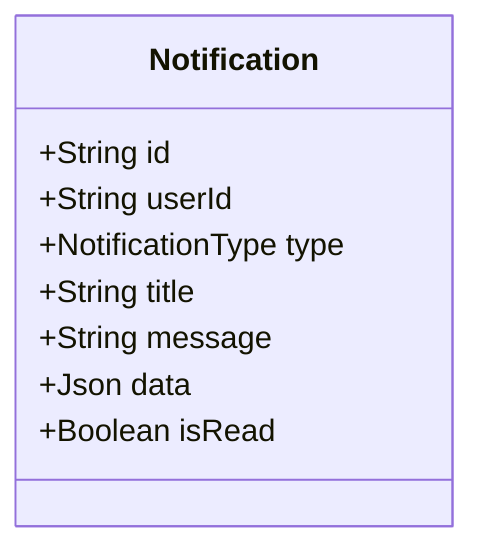

### 알림 유형
```typescript
enum NotificationType {
  PURCHASE        // 구매 완료
  SALE            // 판매 알림
  REVIEW          // 리뷰 알림
  SYSTEM          // 시스템 알림
  PROMOTION       // 프로모션
  FOLLOWER        // 새 팔로워
  COMMENT         // 새 댓글
  WISHLIST        // 위시리스트
  PRODUCT_UPDATE  // 상품 업데이트
}
```

---

## 🔗 통합 반응 시스템

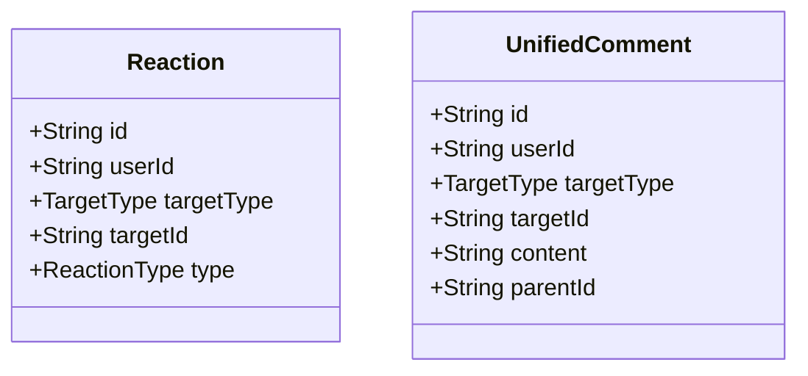

### 대상/반응 유형
```typescript
enum TargetType {
  PRODUCT   // 상품
  TUTORIAL  // 튜토리얼
  POST      // 게시글
  COMMENT   // 댓글
}

enum ReactionType {
  LIKE      // 좋아요
  RECOMMEND // 추천
  HELPFUL   // 도움됨
  BOOKMARK  // 북마크
}
```

---

## 📊 모델 통계

| 모델 | 필드 수 | 관계 수 |
|------|---------|---------|
| User | 20+ | 15+ |
| Product | 25+ | 8 |
| Purchase | 12 | 5 |
| Review | 12 | 3 |
| Post | 12 | 3 |
| Tutorial | 15 | 3 |
| Settlement | 15 | 2 |
| RefundRequest | 12 | 2 |

---

## 🔗 관련 문서

- [[system-overview|시스템 개요]]
- [[tech-stack|기술 스택]]
- [[api-map|API 엔드포인트]]
