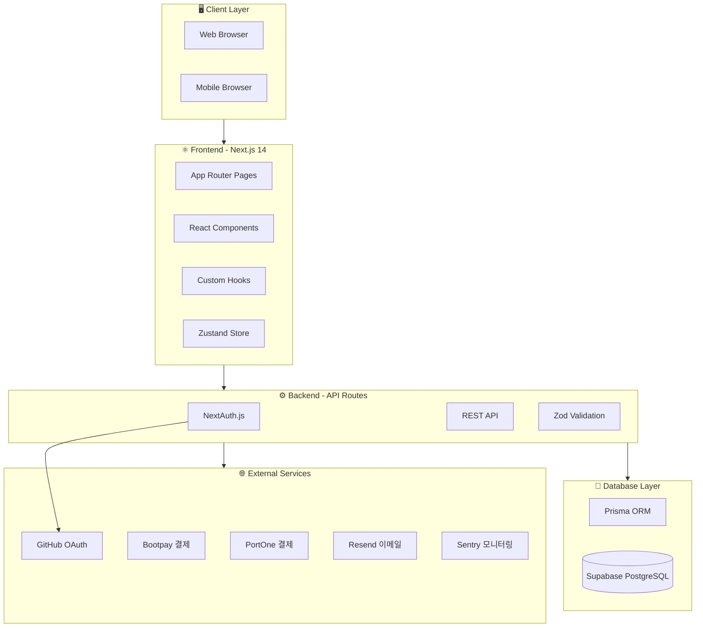
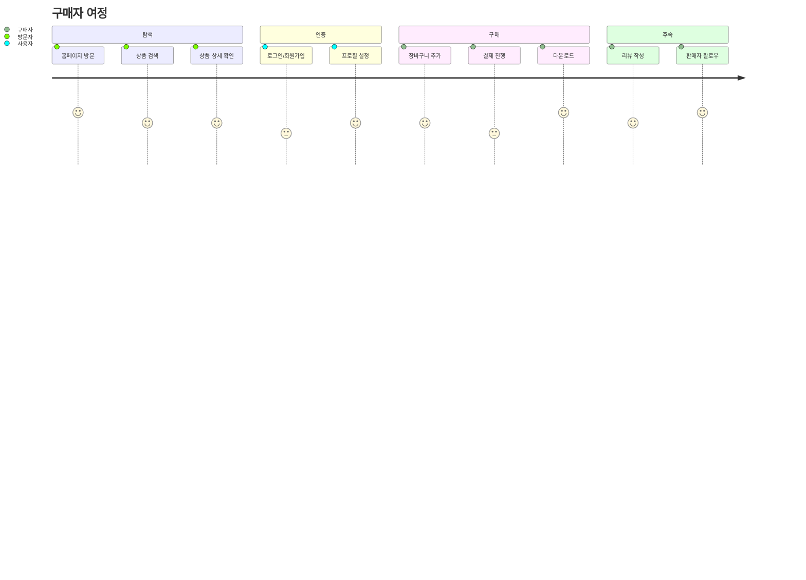
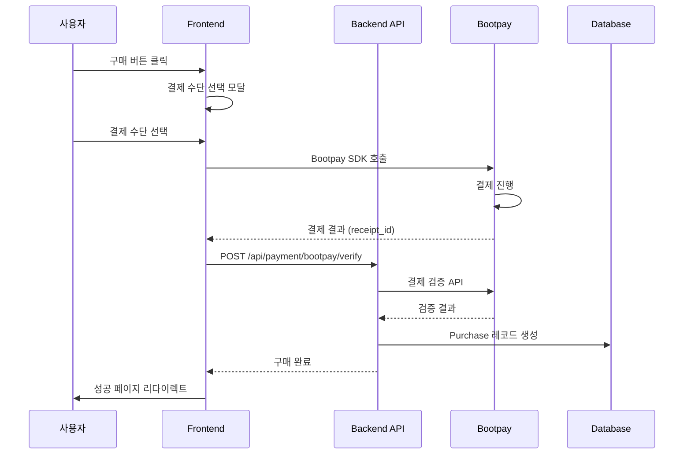

# 🏗️ 시스템 개요 (System Overview)

#architecture #overview

> Vibe Olympics 전체 시스템 아키텍처
> 현재 상태: 개발 완료 → 배포 대기

---

## 📊 시스템 아키텍처 다이어그램



---

## 🎯 서비스 플로우

### 1. 사용자 여정 (User Journey)



### 2. 결제 플로우



---

## 🏛️ 아키텍처 계층

### Layer 1: Presentation (프레젠테이션)
- **Next.js App Router** - 페이지 라우팅
- **React 18** - UI 컴포넌트
- **Tailwind CSS** - 스타일링
- **Framer Motion** - 애니메이션
- **Lucide React** - 아이콘

### Layer 2: Business Logic (비즈니스 로직)
- **API Routes** - RESTful API
- **NextAuth.js** - 인증/인가
- **Zod** - 유효성 검사
- **React Hook Form** - 폼 관리

### Layer 3: Data Access (데이터 접근)
- **Prisma ORM** - 데이터베이스 ORM
- **Supabase** - PostgreSQL + Storage

### Layer 4: External Integration (외부 연동)
- **Bootpay** - 한국 결제 (카드, 간편결제)
- **PortOne** - 추가 결제 옵션
- **Resend** - 트랜잭션 이메일
- **Sentry** - 에러 모니터링

---

## 📈 현재 상태 vs 배포 후

### 현재 상태 (Development)
```
┌─────────────────────────────────────┐
│  localhost:3000                      │
│  ├── 모든 기능 구현 완료             │
│  ├── 61개 테스트 통과                │
│  ├── TypeScript 타입 에러 없음       │
│  └── ESLint 경고 45개 (img→Image)   │
└─────────────────────────────────────┘
```

### 배포 후 (Production)
```
┌─────────────────────────────────────┐
│  https://vibe-olympics.vercel.app   │
│  ├── Vercel Edge Network            │
│  ├── Supabase Cloud DB              │
│  ├── Bootpay 실결제 연동            │
│  ├── GitHub OAuth 활성화            │
│  └── Sentry 에러 모니터링           │
└─────────────────────────────────────┘
```

---

## 🔗 관련 문서

- [[tech-stack|기술 스택 상세]]
- [[api-map|API 엔드포인트 맵]]
- [[database-schema|데이터베이스 스키마]]
- [[page-structure|페이지 구조]]
