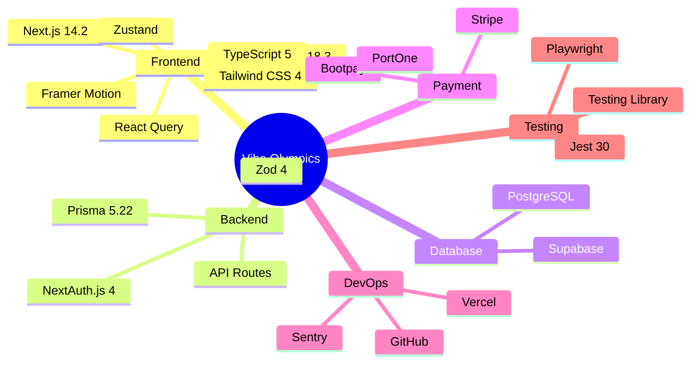
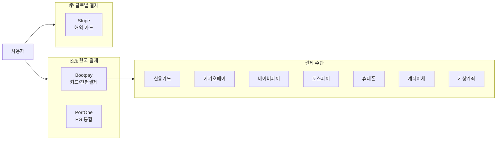
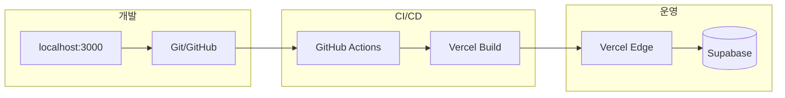

# 🛠️ 기술 스택 (Tech Stack)

#architecture #tech-stack

> Vibe Olympics에서 사용된 모든 기술, 프레임워크, 라이브러리
> 업데이트: 2025년 12월 16일

---

## 📊 기술 스택 마인드맵



---

## 🎨 Frontend

### Core Framework
| 기술 | 버전 | 용도 |
|------|------|------|
| **Next.js** | 14.2.18 | React 프레임워크, App Router |
| **React** | 18.3.1 | UI 라이브러리 |
| **TypeScript** | 5.x | 타입 안전성 |

### Styling
| 기술 | 버전 | 용도 |
|------|------|------|
| **Tailwind CSS** | 4.x | 유틸리티 CSS |
| **class-variance-authority** | 0.7.1 | 컴포넌트 변형 관리 |
| **clsx** | 2.1.1 | 조건부 클래스 |
| **tailwind-merge** | 3.4.0 | Tailwind 클래스 병합 |

### State Management
| 기술 | 버전 | 용도 |
|------|------|------|
| **Zustand** | 5.0.9 | 전역 상태 관리 |
| **React Query** | 5.90.12 | 서버 상태 관리 |
| **React Hook Form** | 7.68.0 | 폼 상태 관리 |

### UI Components
| 기술 | 버전 | 용도 |
|------|------|------|
| **Lucide React** | 0.556.0 | 아이콘 |
| **Framer Motion** | 12.23.25 | 애니메이션 |
| **Recharts** | 3.5.1 | 차트/그래프 |
| **Sonner** | 2.0.7 | 토스트 알림 |

### Content
| 기술 | 버전 | 용도 |
|------|------|------|
| **React Markdown** | 10.1.0 | 마크다운 렌더링 |
| **remark-gfm** | 4.0.1 | GitHub Flavored Markdown |
| **rehype-highlight** | 7.0.2 | 코드 하이라이팅 |

---

## ⚙️ Backend

### API & Auth
| 기술 | 버전 | 용도 |
|------|------|------|
| **Next.js API Routes** | 14.2 | RESTful API |
| **NextAuth.js** | 4.24.13 | 인증/인가 |
| **@auth/prisma-adapter** | 2.11.1 | Prisma 어댑터 |

### Database
| 기술 | 버전 | 용도 |
|------|------|------|
| **Prisma** | 5.22.0 | ORM |
| **@prisma/client** | 5.22.0 | 데이터베이스 클라이언트 |
| **Supabase** | 2.86.2 | PostgreSQL + Storage |

### Validation & Utils
| 기술 | 버전 | 용도 |
|------|------|------|
| **Zod** | 4.1.13 | 스키마 유효성 검사 |
| **bcryptjs** | 3.0.3 | 비밀번호 해싱 |
| **date-fns** | 4.1.0 | 날짜 처리 |
| **uuid** | 13.0.0 | UUID 생성 |
| **xlsx** | 0.18.5 | 엑셀 내보내기 |

---

## 💳 Payment Integration



| 기술 | 버전 | 용도 |
|------|------|------|
| **@bootpay/client-js** | 5.2.2 | Bootpay 클라이언트 SDK |
| **@bootpay/backend-js** | 2.4.1 | Bootpay 서버 SDK |
| **@portone/browser-sdk** | 0.1.1 | PortOne SDK |
| **Stripe** | 20.0.0 | Stripe 서버 SDK |
| **@stripe/stripe-js** | 8.5.3 | Stripe 클라이언트 SDK |

---

## 🌐 External Services

### Communication
| 서비스 | 용도 |
|--------|------|
| **Resend** | 트랜잭션 이메일 발송 |
| **Web Push API** | 푸시 알림 |

### Monitoring
| 서비스 | 용도 |
|--------|------|
| **Sentry** | 에러 추적/모니터링 |
| **Vercel Analytics** | 성능 분석 |

### AI (준비됨)
| 서비스 | 용도 |
|--------|------|
| **Anthropic Claude** | AI 기능 (미래) |

---

## 🧪 Testing

| 기술 | 버전 | 용도 |
|------|------|------|
| **Jest** | 30.2.0 | 단위/통합 테스트 |
| **@testing-library/react** | 16.3.0 | React 컴포넌트 테스트 |
| **@testing-library/jest-dom** | 6.9.1 | DOM 매처 |
| **Playwright** | 1.57.0 | E2E 테스트 |

### 테스트 현황
- ✅ Jest 단위 테스트: 61개 통과
- ✅ API 통합 테스트: 작성 완료
- ⏳ Playwright E2E: 설정 완료 (실행 대기)

---

## 📦 DevOps & Deployment



| 도구 | 용도 |
|------|------|
| **Vercel** | 호스팅/배포 |
| **GitHub** | 소스 코드 관리 |
| **GitHub Actions** | CI/CD |
| **Supabase** | 데이터베이스 호스팅 |

---

## 📁 프로젝트 구조

```
vibe-olympics/
├── src/
│   ├── app/              # Next.js App Router
│   │   ├── api/          # API Routes (35+)
│   │   ├── admin/        # 관리자 페이지
│   │   ├── auth/         # 인증 페이지
│   │   ├── community/    # 커뮤니티
│   │   ├── dashboard/    # 대시보드
│   │   ├── education/    # 교육 센터
│   │   ├── marketplace/  # 마켓플레이스
│   │   └── seller/       # 판매자 페이지
│   ├── components/       # React 컴포넌트
│   │   ├── ui/           # UI 컴포넌트 (Button, Card, etc.)
│   │   ├── layout/       # 레이아웃 컴포넌트
│   │   └── providers/    # Context Providers
│   ├── hooks/            # Custom Hooks
│   ├── lib/              # 유틸리티/설정
│   └── types/            # TypeScript 타입
├── prisma/
│   ├── schema.prisma     # 데이터베이스 스키마
│   └── migrations/       # 마이그레이션
├── docs/                 # 문서 (Obsidian)
├── messages/             # i18n 번역 파일
└── public/               # 정적 파일
```

---

## 🔗 관련 문서

- [[system-overview|시스템 개요]]
- [[api-map|API 엔드포인트]]
- [[database-schema|데이터베이스 스키마]]
