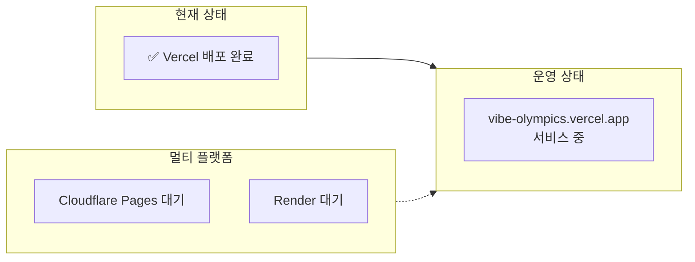
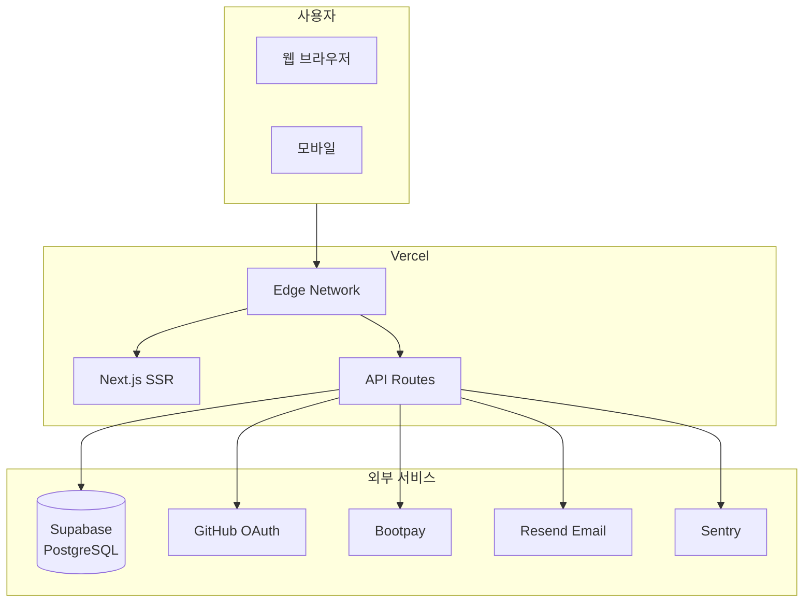

# 🚀 배포 가이드 (Deployment Guide)

#deployment #vercel

> Vibe Olympics 배포 절차
> 현재 → 배포 완료 (Vercel)

---

## 📊 배포 로드맵



---

## ✅ 배포 전 체크리스트

### 코드 상태
- [x] TypeScript 타입 에러 없음
- [x] 빌드 성공 (`npm run build`)
- [x] Jest 테스트 통과 (61개)
- [x] ESLint 에러 없음 (경고만 45개)

### 환경 변수 준비
- [x] DATABASE_URL
- [x] DIRECT_URL
- [x] NEXTAUTH_SECRET
- [x] GITHUB_ID / GITHUB_SECRET
- [x] NEXT_PUBLIC_BOOTPAY_JS_KEY
- [x] BOOTPAY_REST_API_KEY
- [x] BOOTPAY_PRIVATE_KEY
- [x] RESEND_API_KEY
- [x] SENTRY_DSN

---

## 🔧 Step 1: Vercel 프로젝트 생성

```bash
# Vercel CLI 설치 (선택사항)
npm i -g vercel

# 프로젝트 연결
vercel
```

### 또는 웹 대시보드:
1. https://vercel.com 접속
2. "New Project" 클릭
3. GitHub 저장소 선택: `vibeolympics-crypto/vibe-olympics`
4. Framework: Next.js (자동 감지)

---

## 🔐 Step 2: 환경 변수 설정

### Vercel 대시보드에서 설정:
Settings → Environment Variables

```env
# 데이터베이스
DATABASE_URL=postgresql://...
DIRECT_URL=postgresql://...

# 인증
NEXTAUTH_SECRET=your-secret
NEXTAUTH_URL=https://vibe-olympics.vercel.app
GITHUB_ID=your-github-client-id
GITHUB_SECRET=your-github-client-secret

# 결제 - Bootpay
NEXT_PUBLIC_BOOTPAY_JS_KEY=6937dfa984393c6bea36ff0e
BOOTPAY_REST_API_KEY=your-rest-api-key
BOOTPAY_PRIVATE_KEY=your-private-key

# 이메일
RESEND_API_KEY=your-resend-key

# 모니터링
SENTRY_DSN=your-sentry-dsn

# 관리자
ADMIN_EMAILS=admin@example.com
```

### ⚠️ 주의사항
- `NEXT_PUBLIC_` 접두사는 클라이언트에서 접근 가능
- `NEXTAUTH_URL`은 배포 후 실제 도메인으로 설정

---

## 🔗 Step 3: GitHub OAuth 설정

### GitHub Developer Settings:
1. https://github.com/settings/developers
2. OAuth Apps → 앱 선택
3. Callback URL 수정:
   ```
   https://vibe-olympics.vercel.app/api/auth/callback/github
   ```

---

## 🏗️ Step 4: 빌드 설정

### Vercel 빌드 설정:
- Build Command: `prisma generate && next build`
- Output Directory: `.next`
- Install Command: `npm install`
- Node.js Version: 20.x

### vercel.json (이미 설정됨):
```json
{
  "buildCommand": "prisma generate && next build",
  "framework": "nextjs"
}
```

---

## 🚀 Step 5: 배포

### 자동 배포:
- GitHub `main` 브랜치에 push → 자동 배포

### 수동 배포:
```bash
vercel --prod
```

---

## 🔍 배포 후 확인사항

### 기능 테스트
- [ ] 홈페이지 로딩
- [ ] GitHub 로그인
- [ ] 이메일 로그인/회원가입
- [ ] 상품 목록/상세
- [ ] 결제 (Bootpay 샌드박스)
- [ ] 대시보드 접근

### 성능 확인
- [ ] Vercel Analytics 활성화
- [ ] Sentry 에러 모니터링
- [ ] 페이지 로딩 속도

---

## 🌍 배포 후 아키텍처



---

## 📊 배포 상태

| 항목 | 상태 | 비고 |
|------|------|------|
| 코드 준비 | ✅ 완료 | |
| 환경변수 | ⏳ 대기 | Vercel 설정 필요 |
| Vercel 프로젝트 | ⏳ 대기 | 쿨다운 후 생성 |
| 도메인 | ⏳ 대기 | vercel.app 기본 |
| SSL | ✅ 자동 | Vercel 제공 |

---

## 🔗 관련 문서

- [[../system-overview|시스템 개요]]
- [[../tech-stack|기술 스택]]
- [[../../VERCEL_DEPLOYMENT|Vercel 배포 상세]]
