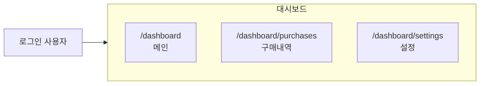
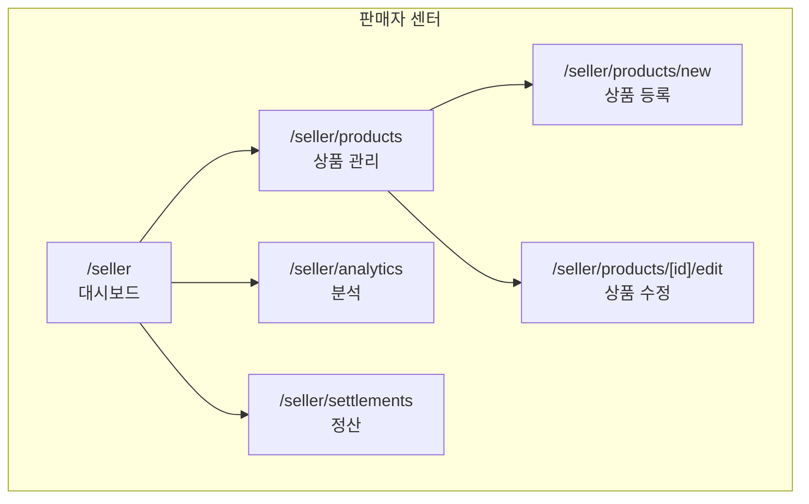
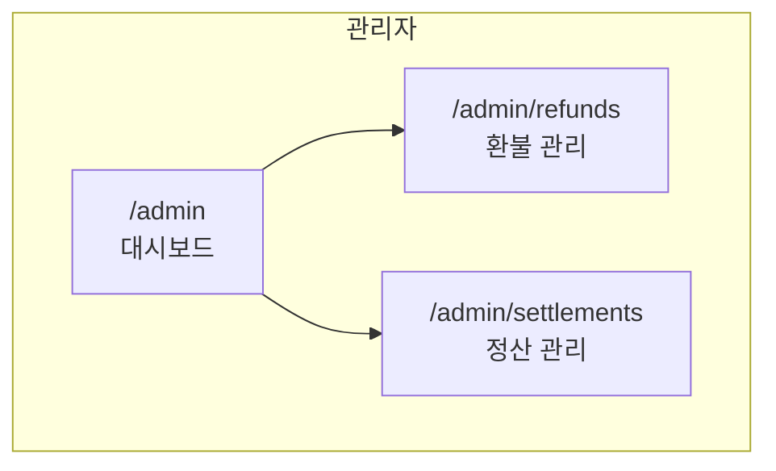
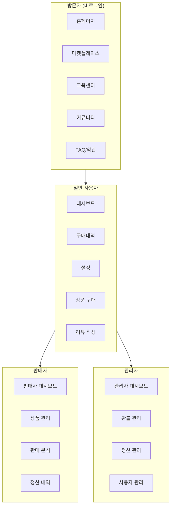

# 📄 페이지 구조 (Page Structure)

#frontend #pages #routing

> Next.js App Router 기반 페이지 라우팅 구조
> 총 25+ 페이지

---

## 🗺️ 사이트맵 마인드맵

```mermaid
mindmap
  root((Vibe Olympics))
    Public
      / Home
      /marketplace
        /[id] 상품상세
      /education
        /[slug] 튜토리얼
      /community
        /[id] 게시글
      /faq
      /terms
      /privacy
      /refund
    Auth
      /auth/login
      /auth/signup
      /auth/forgot-password
      /auth/reset-password
      /auth/error
    Dashboard
      /dashboard
      /dashboard/purchases
      /dashboard/settings
    Seller
      /seller
      /seller/products
      /seller/products/new
      /seller/products/[id]/edit
      /seller/analytics
      /seller/settlements
    Admin
      /admin
      /admin/refunds
      /admin/settlements
```

---

## 🌐 공개 페이지 (Public)

### 메인 페이지

| 경로 | 파일 | 설명 |
|------|------|------|
| `/` | `page.tsx` | 홈페이지 |
| `/marketplace` | `marketplace/page.tsx` | 마켓플레이스 |
| `/marketplace/[id]` | `marketplace/[id]/page.tsx` | 상품 상세 |
| `/education` | `education/page.tsx` | 교육 센터 |
| `/education/[slug]` | `education/[slug]/page.tsx` | 튜토리얼 상세 |
| `/community` | `community/page.tsx` | 커뮤니티 |
| `/community/[id]` | `community/[id]/page.tsx` | 게시글 상세 |

### 정보 페이지

| 경로 | 파일 | 설명 |
|------|------|------|
| `/faq` | `faq/page.tsx` | 자주 묻는 질문 |
| `/terms` | `terms/page.tsx` | 이용약관 |
| `/privacy` | `privacy/page.tsx` | 개인정보처리방침 |
| `/refund` | `refund/page.tsx` | 환불정책 |

---

## 🔐 인증 페이지 (Auth)

```mermaid
flowchart TD
    A[방문자] --> B{로그인 상태?}
    B -->|No| C[/auth/login]
    B -->|Yes| D[Dashboard]
    
    C --> E[이메일 로그인]
    C --> F[GitHub 로그인]
    C --> G[회원가입]
    
    G --> H[/auth/signup]
    
    E --> I{비밀번호 분실?}
    I -->|Yes| J[/auth/forgot-password]
    J --> K[이메일 발송]
    K --> L[/auth/reset-password]
```

| 경로 | 설명 | 인증 |
|------|------|------|
| `/auth/login` | 로그인 | ❌ |
| `/auth/signup` | 회원가입 | ❌ |
| `/auth/forgot-password` | 비밀번호 찾기 | ❌ |
| `/auth/reset-password` | 비밀번호 재설정 | 토큰 |
| `/auth/error` | 인증 에러 | ❌ |

---

## 📊 대시보드 (Dashboard)

> 로그인 필요



| 경로 | 설명 | 인증 |
|------|------|------|
| `/dashboard` | 대시보드 메인 | ✅ |
| `/dashboard/purchases` | 구매 내역 | ✅ |
| `/dashboard/settings` | 계정 설정 | ✅ |

---

## 🏪 판매자 페이지 (Seller)

> 판매자 권한 필요 (isSeller = true)



| 경로 | 설명 | 인증 |
|------|------|------|
| `/seller` | 판매자 대시보드 | ✅ 판매자 |
| `/seller/products` | 상품 목록 | ✅ 판매자 |
| `/seller/products/new` | 상품 등록 | ✅ 판매자 |
| `/seller/products/[id]/edit` | 상품 수정 | ✅ 소유자 |
| `/seller/analytics` | 판매 분석 | ✅ 판매자 |
| `/seller/settlements` | 정산 내역 | ✅ 판매자 |

---

## 🔧 관리자 페이지 (Admin)

> ADMIN 역할 필요



| 경로 | 설명 | 인증 |
|------|------|------|
| `/admin` | 관리자 대시보드 | ✅ Admin |
| `/admin/refunds` | 환불 요청 관리 | ✅ Admin |
| `/admin/settlements` | 정산 관리 | ✅ Admin |

---

## 📁 폴더 구조

```
src/app/
├── page.tsx                    # 홈페이지
├── layout.tsx                  # 루트 레이아웃
├── globals.css                 # 전역 스타일
├── loading.tsx                 # 로딩 UI
├── error.tsx                   # 에러 UI
├── not-found.tsx               # 404 페이지
│
├── marketplace/
│   ├── page.tsx                # 마켓플레이스
│   └── [id]/
│       └── page.tsx            # 상품 상세
│
├── education/
│   ├── page.tsx                # 교육 센터
│   └── [slug]/
│       └── page.tsx            # 튜토리얼 상세
│
├── community/
│   ├── page.tsx                # 커뮤니티
│   └── [id]/
│       └── page.tsx            # 게시글 상세
│
├── auth/
│   ├── login/page.tsx          # 로그인
│   ├── signup/page.tsx         # 회원가입
│   ├── forgot-password/page.tsx
│   ├── reset-password/page.tsx
│   └── error/page.tsx
│
├── dashboard/
│   ├── page.tsx                # 대시보드
│   ├── purchases/page.tsx      # 구매내역
│   └── settings/page.tsx       # 설정
│
├── seller/
│   ├── page.tsx                # 판매자 대시보드
│   ├── products/
│   │   ├── page.tsx            # 상품 목록
│   │   ├── new/page.tsx        # 상품 등록
│   │   └── [id]/edit/page.tsx  # 상품 수정
│   ├── analytics/page.tsx      # 분석
│   └── settlements/page.tsx    # 정산
│
├── admin/
│   ├── layout.tsx              # 관리자 레이아웃
│   ├── page.tsx                # 관리자 대시보드
│   ├── refunds/page.tsx        # 환불 관리
│   └── settlements/page.tsx    # 정산 관리
│
├── faq/page.tsx                # FAQ
├── terms/page.tsx              # 이용약관
├── privacy/page.tsx            # 개인정보
└── refund/page.tsx             # 환불정책
```

---

## 🎯 사용자 역할별 접근 권한



---

## 📊 페이지 통계

| 카테고리 | 페이지 수 |
|----------|-----------|
| 공개 페이지 | 11 |
| 인증 페이지 | 5 |
| 대시보드 | 3 |
| 판매자 | 6 |
| 관리자 | 3 |
| **총계** | **28** |

---

## 🔗 관련 문서

- [[system-overview|시스템 개요]]
- [[tech-stack|기술 스택]]
- [[api-map|API 엔드포인트]]
