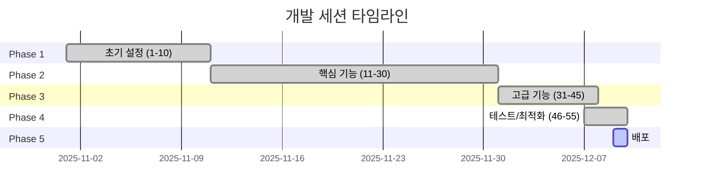
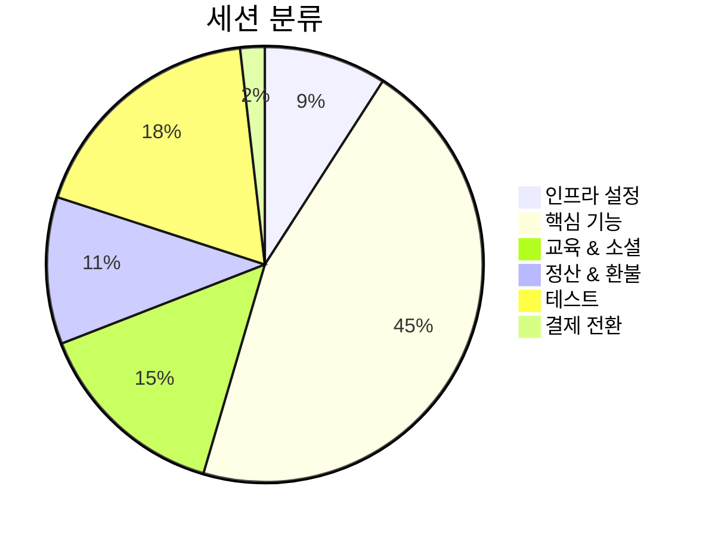

# 📅 세션 인덱스 (Session Index)

#session #history

> 모든 작업 세션 이력
> 총 55개 세션 완료

---

## 📊 세션 타임라인

---

## 🏆 최근 세션 (Session 50-55)

### 세션 55 (2025-12-09) ✅
**주제**: 부트페이 결제 시스템 구현

| 작업 | 상태 |
|------|------|
| Bootpay SDK 설치 | ✅ |
| 클라이언트 라이브러리 생성 | ✅ |
| 서버 API (verify, cancel, webhook) | ✅ |
| 결제 수단 선택 컴포넌트 | ✅ |
| 상품 페이지 연동 | ✅ |
| 테스트 케이스 추가 (13개) | ✅ |

---

### 세션 54 (2025-12-09) ✅
**주제**: 코드 품질 개선

| 작업 | 상태 |
|------|------|
| ESLint 경고 정리 (64→45) | ✅ |
| Jest 테스트 환경 수정 | ✅ |
| 보안 키 노출 점검 | ✅ |
| input.tsx Hook 에러 수정 | ✅ |

---

### 세션 53 (2025-12-09) ✅
**주제**: Vercel 배포 전환

| 작업 | 상태 |
|------|------|
| Cloudflare → Vercel 전환 결정 | ✅ |
| 배포 설정 준비 | ✅ |

---

### 세션 46-52 (2025-12-08~09) ✅
**주제**: API 보안 및 테스트

| 세션 | 주요 작업 |
|------|----------|
| 52 | 인증 필요 API 보안 테스트 |
| 51 | 다국어 및 성능 테스트 |
| 50 | 에러 처리 테스트 |
| 49 | 검색 API 테스트 |
| 48 | 커뮤니티 API 테스트 |
| 47 | 통합 API 테스트 |
| 46 | 알림/팔로우/댓글 테스트 |

---

## 📋 세션 분류

### 🏗️ 인프라 설정 (Infrastructure)

| 세션 | 작업 내용 |
|------|----------|
| 1 | 프로젝트 초기화, Next.js 설정 |
| 2 | Prisma 설정, 데이터베이스 스키마 |
| 3 | NextAuth.js 인증 설정 |
| 4 | Tailwind CSS, UI 컴포넌트 |
| 5 | Supabase 연결 |

### 🛒 핵심 기능 (Core Features)

| 세션 | 작업 내용 |
|------|----------|
| 6-10 | 상품 CRUD |
| 11-15 | 결제 시스템 (Stripe) |
| 16-20 | 사용자 대시보드 |
| 21-25 | 판매자 기능 |
| 26-30 | 커뮤니티 기능 |

### 🎓 교육 & 소셜 (Education & Social)

| 세션 | 작업 내용 |
|------|----------|
| 31-33 | 튜토리얼 시스템 |
| 34-35 | 팔로우 시스템 |
| 36 | Like → Reaction 마이그레이션 |
| 37-38 | 통합 댓글 시스템 |

### 💰 정산 & 환불 (Settlement & Refund)

| 세션 | 작업 내용 |
|------|----------|
| 39-40 | 정산 시스템 |
| 41-42 | 환불 시스템 |
| 43-44 | 관리자 대시보드 |

### 🧪 테스트 & 최적화 (Testing)

| 세션 | 작업 내용 |
|------|----------|
| 45 | Jest 단위 테스트 (61개) |
| 46-52 | API 통합 테스트 |
| 53-54 | 코드 품질 개선 |

### 💳 결제 전환 (Payment Migration)

| 세션 | 작업 내용 |
|------|----------|
| 55 | Stripe → Bootpay 전환 |

---

## 📊 통계

### 주요 성과

| 항목 | 수치 |
|------|------|
| 총 세션 | 55 |
| API 엔드포인트 | 35+ |
| 페이지 | 28 |
| DB 모델 | 20+ |
| Jest 테스트 | 61 |
| TypeScript 타입 | 100% |

---

## 🔗 관련 문서

- [[../TODO|TODO 목록]]
- [[../CHANGELOG|변경 이력]]
- [[../TEST_SPECS|테스트 명세]]
